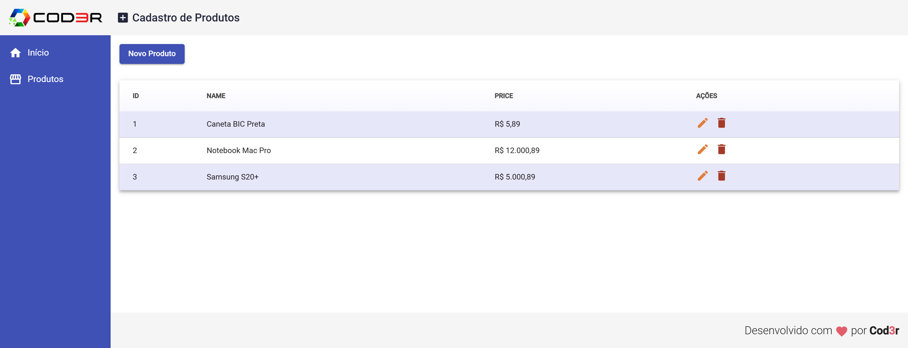

# Frontend

Este projeto foi gerado com a [Angular CLI](https://github.com/angular/angular-cli) versão 9.

## Descrição

Este é um projeto CRUD simples para cadastro de produtos. Ele permite realizar as operações de criação, leitura, atualização e exclusão de produtos em uma aplicação frontend utilizando Angular.

## Imagem do Projeto



## Servidor de Desenvolvimento

Este projeto utiliza duas pastas principais: `frontend` e `backend`.

1. Para iniciar o **servidor de desenvolvimento do frontend**:
   - Navegue até a pasta `frontend`.
   - Execute `npm i` para instalar as dependências.
   - Execute o comando `npm start` ou `ng serve`.
   - Acesse o aplicativo em `http://localhost:4200/`.

2. Para iniciar o **servidor de desenvolvimento do backend**:
   - Navegue até a pasta `backend`.
   - Execute `npm i` para instalar as dependências.
   - Execute o comando do backend `npm start`.

Os aplicativos serão recarregados automaticamente se você alterar qualquer um dos arquivos de origem.

## Mais Ajuda

Para obter mais ajuda sobre a Angular CLI, use `ng help` ou acesse o [README da Angular CLI](https://github.com/angular/angular-cli/blob/master/README.md).

---

## **Requisitos**

Foi utilizada a versão `v16.10.0` do Node.js para o desenvolvimento deste projeto. 

### Como Instalar o Node.js v16.10.0

1. Acesse o site oficial do Node.js: [https://nodejs.org/](https://nodejs.org/).
2. Vá para a seção de versões LTS e procure pela versão `v16.10.0`.
3. Baixe o instalador adequado para o seu sistema operacional (Windows, macOS ou Linux).
4. Siga as instruções do instalador para concluir a instalação.

### Verificar a Versão Instalado

Após a instalação, abra o terminal e execute o seguinte comando para verificar se a versão está correta:

```bash
node -v
```

A saída deve ser semelhante a:

```
v16.10.0
```

### Instalando e Usando a Versão Correta com o nvm (Gerenciador de Versões do Node)

Se você deseja gerenciar várias versões do Node.js, pode instalar o `nvm` (Node Version Manager):

1. Siga as instruções para instalar o `nvm` no repositório oficial: [https://github.com/nvm-sh/nvm](https://github.com/nvm-sh/nvm).
2. Após a instalação, use o comando abaixo para instalar a versão `v16.10.0`:

```bash
nvm install 16.10.0
```

3. Ative a versão instalada:

```bash
nvm use 16.10.0
```

4. Confirme a versão ativa com:

```bash
node -v
```
